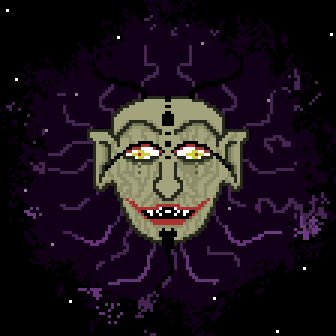

# Third Eye

Third Eye is a danmaku style shooter using a 2d game engine written in C++ using OpenFrameworks. Art was drawn using Asesprite. 

# Features
- sprite system including sprite animation
- sprite emitter system
  - emitter may spawn other emitters
- particle system used for explosions
- physics based player movement
- collision detection
- irrational emitter rotation for visually pleasing enemy shooting pattern

# Sounds
- Menu Music - original
- Game Music - Possession by i_o
- Sound Effects - taken from DotA 2 and free sound libraries

# Video
https://www.youtube.com/watch?v=Y5Qnad39HGo&feature=youtu.be
